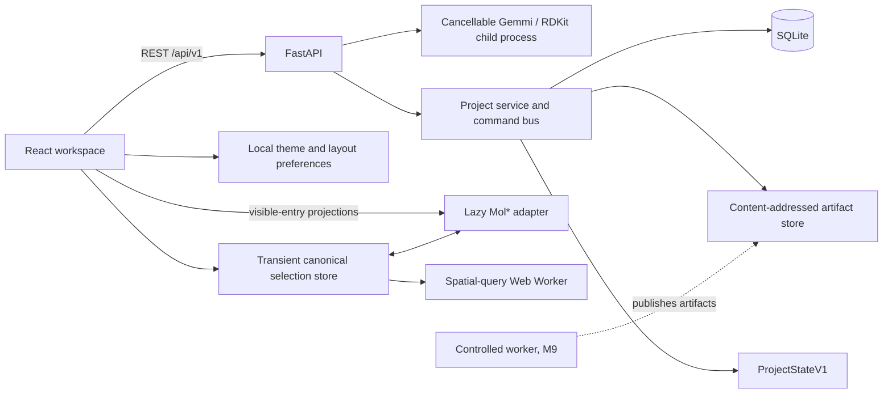

# MolWeave

MolWeave is a local, single-user molecular project workspace. Milestone 3 adds
one authoritative atom-reference selection model across the project browser,
protein sequence, inspector, and lazy Mol* viewer, with deterministic selection
algebra, worker-based spatial queries, and durable named selections.

## Prerequisites

- Python 3.12
- Node.js 22 with Corepack
- A Chromium-compatible Linux, macOS, or Windows development environment

All Python work uses the project-local `.venv`.

## Setup

From the repository root:

```bash
python3.12 -m venv .venv
.venv/bin/python -m pip install uv
.venv/bin/uv sync
corepack prepare pnpm@10.15.1 --activate
corepack pnpm install
MOLWEAVE_DATA_DIR=.molweave .venv/bin/alembic upgrade head
```

## Start Locally

Run the API and web client in separate terminals:

```bash
PYTHONPATH=apps/api/src:packages/molweave_core/src MOLWEAVE_DATA_DIR=.molweave \
  .venv/bin/uvicorn molweave_api.main:app --host 127.0.0.1 --port 8000
```

```bash
corepack pnpm --dir apps/web dev
```

Open [http://127.0.0.1:5173](http://127.0.0.1:5173). Interactive API
documentation is at [http://127.0.0.1:8000/api/docs](http://127.0.0.1:8000/api/docs).

## Architecture



TanStack Query owns API-backed state. Zustand persists only the active project
pointer, theme, and panel preferences; a separate non-persisted Zustand store
owns the current canonical selection. SQLite metadata, named selections, and
immutable normalized artifacts are authoritative. Mol* renders generated
projections and is never a project save format or molecular state store.

See [docs/API.md](docs/API.md), [docs/PROJECT_SCHEMA.md](docs/PROJECT_SCHEMA.md),
[docs/NORMALIZED_SCHEMA.md](docs/NORMALIZED_SCHEMA.md),
[docs/FORMAT_MATRIX.md](docs/FORMAT_MATRIX.md),
[docs/SCIENTIFIC_LIMITATIONS.md](docs/SCIENTIFIC_LIMITATIONS.md), and
[docs/DECISIONS.md](docs/DECISIONS.md) for the current contracts.

## Milestone 3 Checks

Run these from the repository root:

```bash
UV_CACHE_DIR=/tmp/uv-cache .venv/bin/uv run --no-sync ruff check .
UV_CACHE_DIR=/tmp/uv-cache .venv/bin/uv run --no-sync mypy \
  apps/api packages/molweave_core
UV_CACHE_DIR=/tmp/uv-cache .venv/bin/uv run --no-sync pytest \
  tests/unit/test_selection.py tests/integration/test_saved_selections.py
corepack pnpm --dir apps/web lint
corepack pnpm --dir apps/web typecheck
corepack pnpm --dir apps/web test -- selection project-browser sequence
PLAYWRIGHT_BROWSERS_PATH=.playwright corepack pnpm exec playwright test \
  tests/e2e/synchronized-selection.spec.ts
corepack pnpm --dir apps/web build
```

Install the pinned Chromium once before the browser check:

```bash
PLAYWRIGHT_BROWSERS_PATH=.playwright corepack pnpm exec playwright install chromium
```

The Playwright configuration starts an isolated test API and Vite server. Ports
5173 and 8010 must be free while that command runs.
