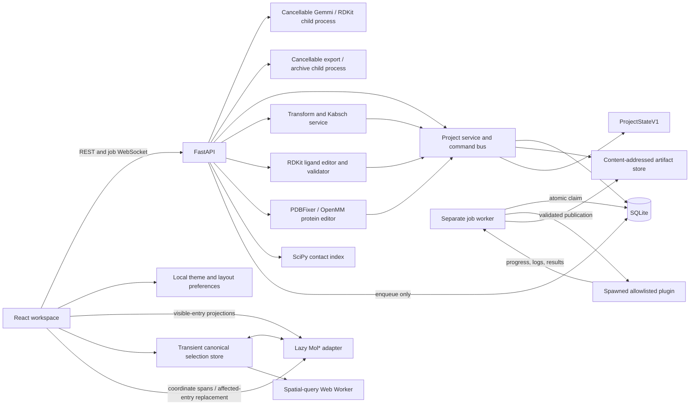

# MolWeave

MolWeave is a local, single-user molecular project workspace. Milestone 9 adds
an allowlisted plugin registry, durable SQLite job queue, controlled spawned
runner, progress/log streaming, cancellation and recovery, immutable input and
result provenance, portable job archives, and a complete demonstration job.
Docking itself is not included.

## Prerequisites

- Python 3.12
- Node.js 22 with Corepack
- A Chromium-compatible Linux, macOS, or Windows development environment

All Python work uses the project-local `.venv`.

## Setup

From the repository root:

```bash
python3.12 -m venv .venv
.venv/bin/python -m pip install uv
.venv/bin/uv sync
corepack prepare pnpm@10.15.1 --activate
corepack pnpm install
MOLWEAVE_DATA_DIR=.molweave .venv/bin/alembic upgrade head
```

## Start Locally

Run the API, job worker, and web client in separate terminals:

```bash
PYTHONPATH=apps/api/src:packages/molweave_core/src:packages/molweave_demo_plugin/src \
  MOLWEAVE_DATA_DIR=.molweave \
  .venv/bin/uvicorn molweave_api.main:app --host 127.0.0.1 --port 8000
```

```bash
PYTHONPATH=apps/api/src:packages/molweave_core/src:packages/molweave_demo_plugin/src \
  MOLWEAVE_DATA_DIR=.molweave .venv/bin/python -m molweave_api.worker
```

```bash
corepack pnpm --dir apps/web dev
```

Open [http://127.0.0.1:5173](http://127.0.0.1:5173). Interactive API
documentation is at [http://127.0.0.1:8000/api/docs](http://127.0.0.1:8000/api/docs).

## Architecture



TanStack Query owns API-backed state. Zustand persists only the active project
pointer, theme, and panel preferences; a separate non-persisted Zustand store
owns the current canonical selection. SQLite metadata, viewer settings, named
selections, measurements, scenes, and immutable normalized artifacts are
authoritative. Mol* renders generated projections and is never a project save
format or molecular state store.

See [docs/API.md](docs/API.md), [docs/PROJECT_SCHEMA.md](docs/PROJECT_SCHEMA.md),
[docs/NORMALIZED_SCHEMA.md](docs/NORMALIZED_SCHEMA.md),
[docs/FORMAT_MATRIX.md](docs/FORMAT_MATRIX.md),
[docs/PLUGIN_GUIDE.md](docs/PLUGIN_GUIDE.md),
[docs/SCIENTIFIC_LIMITATIONS.md](docs/SCIENTIFIC_LIMITATIONS.md), and
[docs/DECISIONS.md](docs/DECISIONS.md) for the current contracts.

## Milestone 9 Checks

Run these from the repository root:

```bash
UV_CACHE_DIR=/tmp/uv-cache .venv/bin/uv run --no-sync ruff check .
UV_CACHE_DIR=/tmp/uv-cache .venv/bin/uv run --no-sync mypy \
  packages/molweave_core/src packages/molweave_demo_plugin/src apps/api/src tests
UV_CACHE_DIR=/tmp/uv-cache .venv/bin/uv run --no-sync pytest \
  tests/unit/jobs tests/integration/test_job_lifecycle.py
UV_CACHE_DIR=/tmp/uv-cache .venv/bin/uv run --no-sync pytest \
  tests/integration/test_worker_recovery.py
corepack pnpm --dir apps/web lint
corepack pnpm --dir apps/web typecheck
corepack pnpm --dir apps/web test -- jobs
PLAYWRIGHT_BROWSERS_PATH=.playwright corepack pnpm exec playwright test \
  tests/e2e/demonstration-job.spec.ts
corepack pnpm --dir apps/web build
```

Install the pinned Chromium once before the browser check:

```bash
PLAYWRIGHT_BROWSERS_PATH=.playwright corepack pnpm exec playwright install chromium
```

The Playwright configuration migrates its isolated test database, then starts
the test API, separate worker, and Vite server. Ports 5173, 8010, and 8011 must
be free while that command runs.
