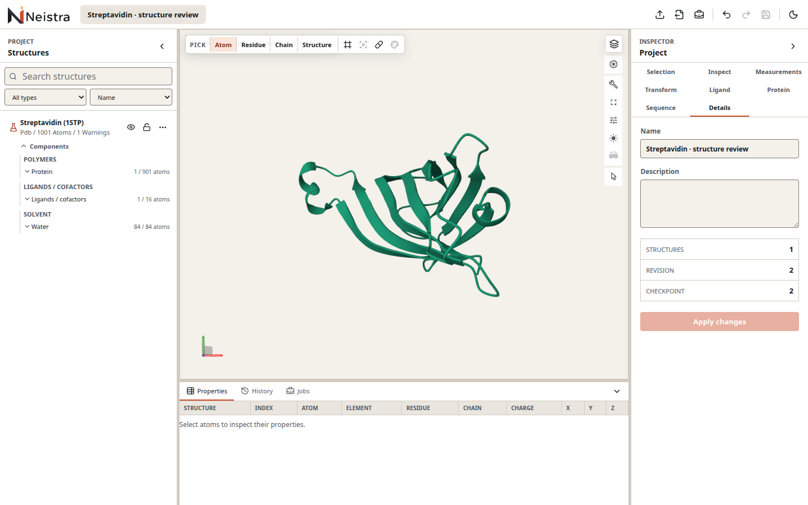
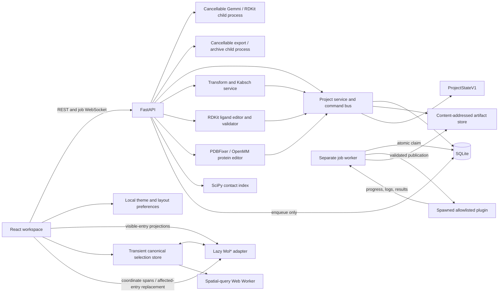

# Neistra

<picture>
  <source media="(prefers-color-scheme: dark)" srcset="docs/assets/neistra-brand-dark.svg">
  
</picture>

Shape molecular structure.

Neistra, formerly MolWeave, is a local, single-user molecular project workspace for importing,
viewing, selecting, measuring, editing, converting, and organizing protein and
small-molecule structures. It includes durable projects, undo/redo, portable
archives, and an allowlisted background-job plugin system. Docking, PDBQT, and
complete protein preparation are deliberately not included.

<picture>
  <source media="(prefers-color-scheme: dark)" srcset="docs/assets/neistra-workspace-dark.png">
  
</picture>

Real workspace screenshots: [light](docs/assets/neistra-workspace-light.png) ·
[dark](docs/assets/neistra-workspace-dark.png). These show the existing local
workspace, not proposed account, docking or marketplace features.

The rebrand leaves the backend and all version values at `0.5.0`. Existing
projects and preferences need no migration. Neistra Archives retain the
`.molweave.zip` format; Python module names, `MOLWEAVE_*` settings and data
paths remain compatible. See [brand and compatibility rules](docs/BRANDING.md)
and [rebranding verification](docs/REBRANDING_VERIFICATION.md). Repository
rename and a numbered release are separate, unexecuted cutover work.

## Prerequisites

- Python 3.12
- Node.js 22 with Corepack
- Git, a C/C++ runtime suitable for the locked scientific wheels, and a
  Chromium-compatible Linux, macOS, or Windows development environment

All Python work uses the project-local `.venv`.

## Setup

From the repository root:

```bash
python3.12 -m venv .venv
.venv/bin/python -m pip install uv
.venv/bin/uv sync --frozen
corepack prepare pnpm@10.15.1 --activate
corepack pnpm install --frozen-lockfile
MOLWEAVE_DATA_DIR=.molweave .venv/bin/alembic upgrade head
```

## Start Locally

After completing setup, migrate and start the API, job worker, and web client
with one command:

```bash
corepack pnpm dev
```

Open [http://127.0.0.1:5173](http://127.0.0.1:5173). Interactive API
documentation is at [http://127.0.0.1:8000/api/docs](http://127.0.0.1:8000/api/docs).
The command prefixes service logs and stops all three processes together when
you press Ctrl+C.

For troubleshooting, the equivalent processes can still be run in separate
terminals after applying migrations manually:

```bash
MOLWEAVE_DATA_DIR=.molweave .venv/bin/uv run alembic upgrade head
```

```bash
PYTHONPATH=apps/api/src:packages/molweave_core/src:packages/molweave_demo_plugin/src \
  MOLWEAVE_DATA_DIR=.molweave \
  .venv/bin/uvicorn molweave_api.main:app --host 127.0.0.1 --port 8000
```

```bash
PYTHONPATH=apps/api/src:packages/molweave_core/src:packages/molweave_demo_plugin/src \
  MOLWEAVE_DATA_DIR=.molweave .venv/bin/python -m molweave_api.worker
```

```bash
corepack pnpm --dir apps/web dev
```

## Architecture



TanStack Query owns API-backed state. Zustand persists only the active project
pointer, theme, and panel preferences; a separate non-persisted Zustand store
owns the current canonical selection. SQLite metadata, viewer settings, named
selections, measurements, scenes, and immutable normalized artifacts are
authoritative. Mol* renders generated projections and is never a project save
format or molecular state store.

See [architecture](docs/ARCHITECTURE.md), [development and troubleshooting](docs/DEVELOPMENT.md),
[HTTP API](docs/API.md), [project/archive schema](docs/PROJECT_SCHEMA.md),
[normalized molecular schema](docs/NORMALIZED_SCHEMA.md), [format matrix](docs/FORMAT_MATRIX.md),
[plugin guide](docs/PLUGIN_GUIDE.md), [scientific limitations](docs/SCIENTIFIC_LIMITATIONS.md),
[fixture provenance](docs/FIXTURES.md), [accessibility](docs/ACCESSIBILITY.md),
[performance](docs/PERFORMANCE.md), [release evidence](docs/VERIFICATION.md), and
[architectural decisions](docs/DECISIONS.md) for the current contracts and their history.

## Release Checks

Run these from the repository root:

```bash
.venv/bin/uv sync --frozen
corepack pnpm install --frozen-lockfile
MOLWEAVE_DATA_DIR=.molweave .venv/bin/uv run alembic upgrade head
.venv/bin/uv run ruff check .
.venv/bin/uv run mypy apps/api packages/molweave_core
.venv/bin/uv run pytest
corepack pnpm --dir apps/web lint
corepack pnpm --dir apps/web typecheck
corepack pnpm --dir apps/web test
corepack pnpm test:dev
corepack pnpm --dir apps/web build
PLAYWRIGHT_BROWSERS_PATH=.playwright corepack pnpm exec playwright test
```

Install the pinned Chromium once before the browser check:

```bash
PLAYWRIGHT_BROWSERS_PATH=.playwright corepack pnpm exec playwright install chromium
```

The Playwright configuration migrates an isolated test database, then starts
the test API, separate worker, and Vite server. Ports 5173, 8010, and 8011 must
be free. See [docs/DEVELOPMENT.md](docs/DEVELOPMENT.md) for focused commands,
environment variables, clean-state procedures, and troubleshooting.
