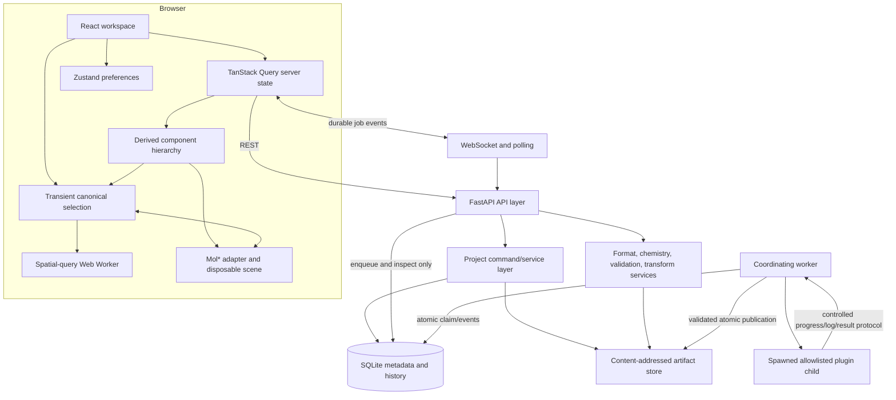

# Architecture

Status: Neistra architecture; existing backend contracts retained.

Neistra is a local three-process application: a browser client, an HTTP API,
and a coordinating job worker. SQLite and a managed content-addressed artifact
directory provide durable local state.

## Ownership Boundaries

- FastAPI owns transport validation and maps domain failures to structured
  HTTP errors; request handlers do not execute plugin work.
- The project service owns revisions, checkpoints, reversible commands,
  history, and relational transactions.
- `NormalizedStructureV1` artifacts own molecular identity, hierarchy,
  chemistry, coordinates, warnings, and inference records. Original upload
  bytes are immutable separate artifacts.
- Gemmi, RDKit, PDBFixer/OpenMM, SciPy, and format writers are adapters or
  services around the normalized model, never alternate project authorities.
- TanStack Query caches API state. Zustand persists only theme, panel layout,
  collapse state, and active-project pointer. Current selection and camera are
  transient unless stored in an application-owned named scene.
- Mol* consumes generated mmCIF/SDF projections plus application settings. Its
  internal tree is disposable and is rebuilt after topology changes; it never
  serializes project state.
- The worker owns job claim/recovery and spawns an allowlisted plugin in a
  controlled child. Only the parent validates and publishes returned bytes.

## Component Hierarchy Ownership

`molweave_core.components` deterministically derives `ComponentHierarchyV1`
from the current `NormalizedStructureV1` artifact. Gemmi contributes optional
source entity, subchain, polymer-type, and tabulated-residue facts only at the
macromolecular adapter boundary; the classifier itself is library-independent.
Source facts take precedence, documented residue/element rules are explicit
fallbacks, and unsupported evidence remains ambiguous and visible.

Component IDs are entry-local opaque hashes over stable source/subchain/chain,
residue, or orphan-atom identity. They never use display labels, coordinates,
array position, proximity, molecular size, recent selection, or Mol* objects.
Polymer source instances and individual non-polymer residues own disjoint
memberships; every normalized atom belongs to exactly one component. Covalent
connectivity does not erase a source residue boundary.

The hierarchy is returned with the artifact-keyed lazy structure response and
is never copied into SQLite, checkpoints, scenes, browser preferences, or
archives. Coordinate-only edits therefore retain exact IDs and membership;
topology edits derive current membership again from retained normalized
identities. Category and component nodes materialize the existing canonical
atom-reference selection. Existing Protein, Ligands, Solvent, and Ions viewer
settings filter application memberships before Mol* receives a disposable
bundle; categories without a mapped setting, including unclassified material,
remain visible.

## Viewer Interaction Semantics

Mol* owns hit testing and the distinction between a click and a camera drag.
Neistra consumes the resulting primary mouse or touch activation and translates
structural loci immediately into canonical application atom references at the
active Atom, Residue, Chain, or Structure granularity. An unmodified hit replaces
selection, Ctrl/Meta/Shift adds, and Alt subtracts. An unmodified empty hit clears
a non-empty selection; an empty hit with a modifier, or while selection is already
empty, is a no-op.

Primary and primary-equivalent trigger activations are deliberately absent from
Mol* camera-focus and representation-focus bindings. Selection clicks therefore
do not frame a hit or reset the camera. Secondary camera behavior and Mol*'s
trackball gestures remain owned by Mol*, while camera framing occurs only through
explicit application operations such as `focusAtoms` and `fitVisible`.

These interactions update transient viewer/application state only. They do not
issue project commands, refetch normalized structures, mutate molecular data, or
persist ordinary selection or camera state.

## Selection Representation Ownership

Selection-specific representations are durable `ViewerSettingsV1` records,
not Mol* state and not a property of the transient current selection. Each
entry stores canonical normalized atom IDs grouped by one atomic style (`line`,
`stick`, `thick-stick`, `ball-and-stick`, or `space-filling`) or one polymer
style (`backbone` or `cartoon`). Applying a style replaces membership only in
its channel for the selected atoms; reset removes those atoms from both
channels so they inherit entry-level settings again. One project command
applies the same canonical multi-entry selection atomically and records exact
forward/inverse settings for undo and redo.

The API validates stable references. Polymer application additionally reads
the current authoritative normalized artifact and accepts only complete
supported protein, DNA, or RNA residues with the required trace atoms. The
browser may preflight the same rule to explain unavailable actions, but the
service remains authoritative. Topology deletions prune missing atom IDs from
live and named-scene settings in the same reversible molecular command;
coordinate changes and topology additions do not infer new membership.

The browser projects entry-level and selection-specific settings into
disposable exact Mol* bundle components. Targeted atoms replace only the
inherited atomic or polymer channel; independent surfaces are not subtracted.
Every layer is intersected with current component, hydrogen, and isolation
visibility. Exact atomic layers disable parent-bond expansion, so a bond is not
drawn across an unselected boundary. Rebuilding the projection restores the
application camera and canonical selection and reuses the artifact-keyed
normalized-structure query. Color, opacity, labels, surfaces, component
classification, and molecular data retain their existing owners.

## Hydrogen Visibility Ownership

`ViewerSettingsV1.components` stores two independent booleans. `hydrogens`
is the master switch and `nonpolar_hydrogens` is a preserved preference that
only has an effect while the master switch is enabled. Their effective modes
are therefore:

- both `true`: show all explicit hydrogens;
- `hydrogens=true`, `nonpolar_hydrogens=false`: show only explicit hydrogens
  bonded to N, O, S, F, Cl, Br, or I;
- `hydrogens=false`: show no hydrogens, regardless of the preserved dependent
  preference.

Every inherited and selection-specific Mol* layer receives the same effective
mode. All mode leaves hydrogen inclusion unrestricted; polar-only mode uses
the pinned Mol* `non-polar` ignore variant; none mode uses its `all` ignore
variant. Polar-only classification consequently depends on explicit projected
connectivity and the pinned neighbor-element set, not coordinates, names,
residue templates, or application-side chemistry inference. Application atom
IDs, bonds, coordinates, artifacts, warnings, and original uploads never
change. Atom labels remain controlled independently by `labels.atoms`.

Viewer rebuilds restore the application camera and canonical selection and
reuse the artifact-keyed normalized-structure query. Ligand focus uses only
heavy atoms in polar-only and none modes so navigation remains deterministic
without asking Mol* to expose its per-representation hydrogen classification.

## Persistence

SQLite stores projects, entries, groups, checkpoints, bounded command history,
artifact metadata, jobs, inputs, results, and ordered events. Artifact files
are hash-addressed beneath the managed root and published with temporary-file,
`fsync`, and atomic-replace semantics. Project mutations use optimistic
`expected_revision`; artifacts may be orphaned by a failed transaction but a
project never points to unpublished bytes.

Portable `.molweave.zip` archives use `ProjectManifestV1`, checksums, safe
relative member paths, and an allowlisted media/type model. They contain the
current checkpoint-compatible state and required immutable artifacts, not an
executable process or opaque viewer snapshot.

## Jobs And Extension

The API and worker independently discover the same installed, allowlisted
`JobPlugin` definitions. Submission validates a JSON-schema parameter object
and snapshots exact input artifacts. The worker uses atomic database claims,
durable progress/log/state events, cooperative cancellation with termination
fallback, result count/byte limits, and abandoned-worker recovery. Core models
remain docking-neutral; receptor, ligand, pose, score, and engine semantics
belong to a future plugin described in `PLUGIN_GUIDE.md`.

## Dependency Choices

React/Vite provide the typed workspace and build; TanStack Query separates
remote cache from Zustand preferences; Mol* supplies established molecular 3D
rendering; FastAPI/Pydantic provide typed local HTTP contracts; SQLAlchemy and
Alembic provide replaceable persistence and migrations; Gemmi handles
macromolecular hierarchy; RDKit handles small-molecule chemistry; PDBFixer and
OpenMM provide deliberately limited protein templates/hydrogens; SciPy supplies
the contact spatial index; Pytest/Vitest/Playwright/axe cover domain, component,
real-browser, WebGL, and detectable accessibility behavior.

## Selection appearance extension

Issue #29 stores local color memberships independently of atomic/polymer style
channels. The dedicated revisioned project command owns persistence and exact
history; Mol* receives disposable overpaint bundles intersected with rendered
layer membership. It does not own colors or molecular state. See D-052 and the
issue feature plan for retained-history migration and compatibility guarantees.

Selection-local hydrogen preferences extend this command without introducing a
polarity service. The backend resolves explicit selected H from normalized data;
the Mol* adapter classifies on its full disposable projection before producing
visibility masks for inherited, exact-selection and surface layers. Subsets never
reclassify an O–H hydrogen after dropping its oxygen. Local preferences override
entry nonpolar preferences but not master/component/isolation bounds (D-053).

Carbon-only selection coloring extends this command (D-054): resolve C targets
from authoritative normalized elements; persist chosen hex colors on C and explicit
`element` assignments on the other selected IDs. The disposable viewer projects
those assignments through Mol*'s default element palette, preserving native theme
adjustments even when the underlying entry theme is custom. Existing disjoint
membership/history/archive/pruning behavior applies; no geometry or molecular state
is added. Empty appearance collections avoid the additional palette-resolution pass.
