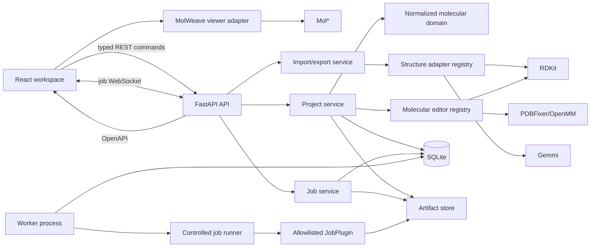

# MolWeave v0.1 Implementation Plan

Status: approved implementation plan

This document translates `docs/PRODUCT_SPEC.md` into an implementation sequence
for MolWeave v0.1. It is intentionally limited to v0.1. A feature is not complete
until its vertical workflow, error states, tests, and documentation are complete.
Controls for later milestones must be omitted or visibly disabled; they must not
suggest that unavailable functionality works.

## 1. Product boundary

MolWeave v0.1 is a local, single-user molecular workspace. It must support the
complete path from project creation through structure import, inspection,
selection, editing, persistence, export, and demonstration-job result import.
Docking is not part of v0.1, but the job and plugin interfaces must be sufficient
for a separately developed docking package to integrate without adding
docking-specific concepts to the core application.

### Required in v0.1

- The complete non-conditional functionality in `docs/PRODUCT_SPEC.md`.
- A Mol* molecular surface, because Mol* provides a practical implementation.
- Named scenes containing camera, visibility, representation, and selection
  state.
- Basic close-contact detection using spatial indexing.
- PDBx/mmCIF support when the product specification refers to mmCIF or CIF.
- A working demonstration job that uses the same public plugin path as future
  integrations.

### Explicitly deferred

- Docking, scoring, pose management, and PDBQT.
- General small-molecule crystallographic CIF. v0.1 CIF means PDBx/mmCIF.
- Interactive side-chain rotamer browsing and rotamer optimization. Standard
  residue mutation uses a deterministic template and reports clashes.
- Full protein preparation, pKa prediction, protonation-state enumeration,
  missing-loop construction, terminal capping, force-field assignment,
  molecular dynamics, and whole-complex minimization.
- Trajectory playback, volumetric maps, electron density, and advanced analysis.
- Authentication, multiple users, collaborative editing, remote projects,
  PostgreSQL, object storage, and distributed job queues.
- Runtime installation or execution of user-supplied plugins or commands.

## 2. Target architecture

### 2.1 Repository layout

The repository will use a TypeScript/Python monorepo:

```text
apps/
  web/                      React application
  api/                      FastAPI application and worker entry points
packages/
  molweave_core/            Molecular domain, adapters, editors, validation,
                            persistence interfaces, jobs, and artifact APIs
  molweave_demo_plugin/     Demonstration JobPlugin implementation
tests/
  e2e/                      Playwright workflows and browser fixtures
  fixtures/                 Scientific input and expected-result fixtures
docs/                       Architecture, schemas, format matrix, limitations,
                            API, plugin, and docking-integration documentation
```

Python dependencies and tools are locked with `uv`; JavaScript dependencies use
`pnpm`. Root scripts provide consistent `lint`, `typecheck`, `test`, `build`, and
`e2e` entry points, while the milestone commands below remain directly runnable.

### 2.2 System relationships



The normalized molecular domain and project database are authoritative. Mol*,
RDKit, Gemmi, and PDBFixer/OpenMM are adapters or services around that state,
never alternative sources of project truth.

## 3. Technology choices

### 3.1 Frontend

| Choice | Purpose and rationale |
|---|---|
| React + TypeScript + Vite | A typed client with fast local development and no need for server rendering. |
| TanStack Query | Owns remote project, entry, artifact, and job cache state and mutation invalidation. |
| Zustand | Owns transient workspace state such as active tool, central selection, layout, previews, and camera mode without coupling it to the viewer. |
| Mol* | Provides mature macromolecular WebGL rendering, representations, surfaces, selection loci, labels, and cameras. It is hidden behind `MolecularViewer`. |
| Radix UI primitives | Accessible low-level menus, dialogs, tabs, tooltips, toggles, and popovers while preserving original MolWeave styling. |
| `react-resizable-panels` | Implements resizable and collapsible desktop panels with persisted sizes. |
| TanStack Table | Provides a scalable property table with sorting, filtering, and selection. |
| Lucide React | Supplies consistent non-proprietary icons; labels and tooltips remain application-specific. |
| Web Workers | Run large selection queries and spatial calculations without blocking interaction. |
| Vitest + Testing Library + Playwright | Cover components, stores, viewer contracts, and complete browser workflows. |

The frontend is split into server state, project-session state, and viewer
projection state. Mol* events are converted immediately to stable MolWeave atom
references. No component reads Mol* internals to answer domain questions.

### 3.2 Backend and persistence

| Choice | Purpose and rationale |
|---|---|
| FastAPI + Pydantic | Typed HTTP/WebSocket contracts, structured validation errors, and generated OpenAPI documentation. |
| SQLAlchemy 2 + Alembic | Explicit relational persistence and migrations, with a future PostgreSQL path. |
| SQLite in WAL mode | Durable zero-service local persistence suitable for one API and one worker. |
| Managed content-addressed filesystem | Keeps large originals, normalized snapshots, exports, logs, and results out of SQLite while retaining stable IDs and hashes. |
| Gemmi | Robust PDB/PDBx/mmCIF parsing, writing, hierarchy, sequence, and macromolecular metadata handling. |
| RDKit | Small-molecule parsing, graph editing, sanitization, valence and stereo checks, hydrogen operations, coordinate generation, and MMFF/UFF cleanup. |
| PDBFixer/OpenMM | Standard-residue templates and hydrogen placement behind a constrained protein-editing adapter. |
| NumPy | Coordinate transforms, Kabsch superposition, and numeric validation. |
| SciPy `cKDTree` | Spatial selections and basic close-contact detection in backend reference calculations. |
| Pytest + Hypothesis + Ruff + mypy | Scientific unit/integration tests, invariant tests, linting, and static typing. |

PDBFixer is pinned to a tested revision because its normal installation path and
OpenMM compatibility require care. A dependency smoke test must run before
protein editing begins. If the pinned combination cannot be reproduced on all
supported development platforms, M7 is blocked rather than replaced with an
unvalidated template implementation.

### 3.3 API contract

All endpoints live under `/api/v1`. Pydantic schemas generate the OpenAPI
document; `openapi-typescript` and `openapi-fetch` generate and consume the
frontend client. The initial resource groups are:

```text
/projects
/projects/{project_id}/entries
/projects/{project_id}/imports
/projects/{project_id}/commands
/projects/{project_id}/history/undo
/projects/{project_id}/history/redo
/projects/{project_id}/exports
/projects/{project_id}/archive
/projects/{project_id}/selections
/projects/{project_id}/measurements
/projects/{project_id}/scenes
/projects/{project_id}/jobs
/jobs/{job_id}/cancel
/jobs/{job_id}/events
/artifacts/{artifact_id}
/ws/jobs
```

Every project mutation includes `expected_revision`. A successful command
increments the project revision and returns the affected entity summaries plus a
`StructurePatch` when molecular data changed. A stale command receives HTTP 409
with the current revision. Uploads and downloads are streaming operations.

WebSocket events are resumable by durable event sequence number. If a socket is
unavailable, the frontend polls job and event endpoints with bounded backoff.

## 4. Domain and data architecture

### 4.1 Versioned project schema

`ProjectManifestV1` is the portable and documented project schema. It contains:

- Schema and application version.
- Project UUID, name, description, timestamps, working revision, and checkpoint
  revision.
- Group tree and stable ordering.
- Entry records and their immutable original/current artifact references.
- Entry name, description, structure type, original filename, source format,
  visibility, locked state, metadata, dirty state, timestamps, job links, and
  result provenance.
- Representations, measurements, named selections, and named scenes.
- Referenced job summaries and artifacts needed to understand imported results.
- SHA-256 and byte length for each file in the archive.

Project, entry, group, job, command, artifact, selection, measurement, and scene
IDs are UUIDv7. Atom and bond IDs are entry-local monotonically increasing
unsigned integers and are never reused.

### 4.2 Normalized molecular model

`NormalizedStructureV1` uses typed, library-independent records:

```text
Structure
  identity, structure type, title, metadata, active conformer
  chains[]
  residues[]
  atoms[]
  bonds[]
  conformers[]
  annotations[]
  warnings[]
  inference records[]
```

Atoms retain name, element, coordinates, residue/chain membership, formal charge
when known, source index, alternate-location identifier, occupancy, B factor,
and inference flags. Bonds retain endpoints, order when known, aromaticity,
stereo when known, and inference flags. Residues retain author and label
numbering, insertion code, component type, and sequence mapping. Missing,
unknown, and inferred values are distinct.

The backend stores float64 coordinates. The frontend materializes atom IDs,
coordinates, elements, residue indices, and bond endpoints in typed arrays.
Topology edits replace only the affected structure payload. Coordinate-only
commands return coordinate spans; visibility, selection, representation, and
camera operations never serialize the molecular structure.

### 4.3 Selection and measurement models

The central selection is an ordered set of `(structure_id, atom_id)` references
plus the semantic granularity and source of the last operation. All viewer,
browser, sequence, inspector, editing, transform, and measurement tools consume
this representation.

Selection operations are pure functions:

- Replace, add, subtract, clear, and invert.
- Expand to residue, chain, or structure.
- Filter by atom name, element, residue name, author/label residue number,
  chain, or structure.
- Select atoms or whole residues within a distance of a seed selection.

Named selections persist an immutable reference set. Deleting referenced atoms
does not silently delete the saved selection; it removes invalid references and
records a warning.

Measurements store two, three, or four stable atom references, a user label,
visibility, style, and timestamps. Values derive from current coordinates.
Deleting an endpoint marks the measurement invalid until it is repaired or
deleted.

### 4.4 Viewer abstraction

`MolecularViewer` exposes only application concepts:

```text
mount, dispose
loadStructure, unloadStructure, applyStructurePatch
setRepresentations, setComponentVisibility, setSelection
setMeasurements, setLabels
setCameraMode, orbit, pan, zoom, focus, center, reset
captureCamera, restoreCamera
subscribeSelection, subscribeCamera, subscribeReady, subscribeError
```

It maintains a map between MolWeave atom IDs and Mol* loci. Viewer snapshots are
never used as project saves. Viewer updates are per structure and debounced.

### 4.5 Commands and edit history

Every user action that changes persisted project state is a typed backend
command. This includes entry metadata, import and result import, visibility,
representations, saved selections, measurements, scenes, molecular edits, and
coordinate changes. A command stores:

- Command type and schema version.
- Human-readable description.
- Project revision before and after.
- Affected structure IDs and selection snapshot.
- Validated forward data.
- An inverse delta, or immutable before/after molecular snapshot references.
- Warnings and validation results.
- Actor and timestamps, with a fixed local actor in v0.1.

History holds 200 commands per project. Older commands are compacted at a saved
checkpoint and unreferenced artifacts become eligible for garbage collection.
Interactive transforms preview locally and commit once. A failed command changes
nothing. Undo and redo are commands with the same atomic guarantees.

Job submission, progress, completion, and cancellation are append-only
operational events rather than edit-history commands. Importing a job result is
an undoable project command. Cancellation displays an irreversible-action
confirmation. Transient camera navigation, hover, unsaved selection, tool mode,
and panel layout are session state rather than edit-history commands; explicitly
saving a selection or scene is a command.

## 5. File adapters and scientific behavior

### 5.1 Adapter contract

Each `StructureAdapter` declares format name, extensions, media types, import and
export capabilities, multi-record support, and loss characteristics. It returns:

```text
ParseResult
  normalized structures
  structured warnings and errors
  source facts and inference records

ExportResult
  artifact(s)
  deterministic filenames
  structured warnings and loss report
```

Adapters receive bytes or controlled artifact handles, never arbitrary paths.
PDBQT can later register another adapter without changing project models.

### 5.2 Format matrix

| Format | Import | Export | v0.1 behavior |
|---|---:|---:|---|
| PDB | Yes | Yes | Gemmi hierarchy and metadata; bond order is unknown unless reliable connectivity exists; field-limit warnings. |
| PDBx/mmCIF | Yes | Yes | Preferred macromolecular interchange; preserve original categories in the immutable upload even when normalized export cannot reproduce all categories. |
| SDF | Yes | Yes | RDKit; each record becomes an entry; properties and conformers are retained where possible. |
| MOL | Yes | Yes | RDKit V2000/V3000; V3000 selected when V2000 limits would be exceeded. |
| MOL2 | Yes | Yes | RDKit import limitations are surfaced; deterministic MolWeave writer and SYBYL type mapping are covered by reference fixtures. |
| XYZ | Yes | Yes | Coordinates and elements are native; connectivity and order are absent unless explicitly inferred. |
| SMILES | Yes | Yes | Discrete small molecules only; import generates 3D coordinates when requested and records inference; export warns about discarded 3D and unsupported metadata. |

Export warnings cover bond orders, formal charges, metadata, conformers, chain
information, residue numbering, atom names, stereochemistry, and inferred data.
The user must acknowledge blocking loss warnings before generation.

### 5.3 Upload and archive safety

Defaults are configurable but initially set to:

- 100 MiB per uploaded structure file.
- 500 MiB aggregate upload request.
- 1 GiB total uncompressed project archive.
- Warning at 250,000 atoms per entry.
- Hard rejection at 1,000,000 atoms per entry.

Filenames are normalized to a safe display name and never used as storage paths.
Archive extraction rejects absolute paths, `..`, duplicate paths, symlinks,
unsupported schema versions, decompression-ratio abuse, size-limit violations,
and hash mismatches. Export names are collision-safe and never overwrite an
existing server artifact.

## 6. Persistence and recovery

SQLite stores relational metadata, not large molecular blobs. The artifact store
uses:

```text
data/
  artifacts/sha256/<first-two-hex>/<full-hash>
  work/<operation-id>/
  exports/<artifact-id>/
```

Writes stream into an operation work directory, validate and hash, fsync where
supported, atomically rename into the content-addressed location, and commit the
database reference last. An artifact is immutable after publication.

Every acknowledged command is durable, even if the user has not selected Save.
Save creates a named checkpoint and clears the project/entry dirty indicators.
On reopen, a working revision newer than the checkpoint is labeled recovered.
The user may continue, save it, undo it, or revert to the checkpoint.

Storage protocols separate relational and artifact operations from SQLAlchemy
and local filesystem implementations, allowing future PostgreSQL and object
storage adapters.

## 7. Job and plugin architecture

### 7.1 Stable interfaces

- `JobDefinition`: type, implementation version, Pydantic parameter model,
  accepted input roles, result roles, and resource policy.
- `JobRunner`: validates, snapshots inputs, creates a controlled work directory,
  executes, cancels, captures structured failure, and publishes results.
- `JobResult`: status, result artifacts, structured values, warnings, and
  provenance.
- `Artifact`: stable ID, media type, role, hash, size, creator, provenance, and a
  controlled read handle.
- `JobPlugin`: registers one or more definitions with an allowlisted registry.
- `JobContext`: cancellation check, progress reporter, stdout/stderr logger, and
  artifact publisher. It cannot execute arbitrary shell commands.

### 7.2 Durable lifecycle

The API writes a queued job and immutable input snapshot references in one
transaction. A separate worker uses a short SQLite transaction to atomically
claim one queued job. Plugin code runs in a spawned child process, not the HTTP
process or worker coordinator.

Progress, messages, stdout, stderr, state transitions, and errors are durable
ordered job events. Cancellation writes a request flag; cooperative plugins see
it through `JobContext`, and the runner terminates the child after a grace
period. On startup, the worker marks abandoned running jobs failed with
`worker_lost`; it does not retry a plugin unless that definition explicitly
declares idempotent retry behavior in a future version.

Configured plugin entry points are loaded only at server startup from an
allowlist. Inputs are artifact handles and validated parameters. Work directories
are private to a job. File paths, wall time, memory/CPU policy where the platform
supports it, output sizes, and artifact media types are validated.

### 7.3 Demonstration plugin

The demonstration job:

1. Accepts one or more structure artifacts and a validated step count/delay.
2. Calculates atom, residue, chain, element, and molecular-weight statistics.
3. Emits logs and progress over several cancellable steps.
4. Optionally applies a validated translation to a copied structure.
5. Publishes a JSON statistics artifact and normalized structure artifact.
6. Allows the returned structure to be imported as an undoable project entry
   linked to the job and every input.

The plugin guide will use this implementation to identify the exact docking
integration points for receptor/ligand roles, parameters, logs, progress, poses,
scores, and result artifacts without defining docking-specific core types.

## 8. Vertical milestones

Each milestone ends in a working user workflow. The full lint, type-check, unit,
build, and relevant end-to-end gates must pass before the next milestone starts.
`docs/PROGRESS.md` is updated during implementation with the completed scope,
verification, limitations, blockers, and next action.

### M1 - Durable project workspace

Deliver the responsive desktop shell, original light/dark visual system,
resizable/collapsible panels, project creation/list/reopen/save, SQLite
migrations, artifact storage, group and entry metadata, the command bus, bounded
undo/redo, checkpoints, dirty indicators, and interrupted-session recovery.

Acceptance criteria:

- A project created in the UI survives API and browser restarts.
- Rename, duplicate, group, lock, hide, isolate, and delete entry operations are
  durable and reversible. Until entries exist, these behaviors are tested through
  seeded normalized fixtures rather than non-functional UI.
- Undo/redo descriptions, project revisions, dirty state, and recovered state are
  correct across reload.
- Panel sizes, collapsed state, and theme persist without entering project
  molecular state.
- Artifact paths cannot escape the configured storage root.
- No control for later functionality is presented as working.

Verification:

```bash
uv run ruff check .
uv run mypy apps/api packages/molweave_core
uv run pytest tests/unit/test_commands.py tests/integration/test_project_lifecycle.py
pnpm --dir apps/web lint
pnpm --dir apps/web typecheck
pnpm --dir apps/web test -- project-workspace
pnpm exec playwright test tests/e2e/project-lifecycle.spec.ts
pnpm --dir apps/web build
```

### M2 - Format-to-viewer scientific slice

Deliver every v0.1 import adapter, multi-file import, immutable original
preservation, normalized snapshots, warnings, individual export through every
adapter, lazy structure loading, the Mol* abstraction, and simultaneous basic
protein/ligand display.

Acceptance criteria:

- Every required format fixture imports or fails with a structured, actionable
  error tied to the file and operation.
- PDB/mmCIF and ligand fixtures display simultaneously and reappear after reload.
- Round trips preserve supported information and enumerate every known loss.
- MOL2 typing, PDB ligand bonds, XYZ inference, SMILES coordinate generation,
  alternate locations, insertion codes, models, and conformers have explicit
  fixtures.
- Large imports show progress, can be cancelled before commit, and enforce the
  documented warning and hard limits.
- The original upload remains byte-for-byte retrievable after edits and export.

Verification:

```bash
uv run pytest tests/unit/adapters tests/integration/test_import_export.py
uv run pytest tests/scientific/test_format_fidelity.py
pnpm --dir apps/web test -- structure-loading viewer-adapter
pnpm exec playwright test tests/e2e/import-display-export.spec.ts
pnpm --dir apps/web build
```

### M3 - Project browser, selection, and sequence

Complete entry sorting, filtering, search, group interaction, multi-selection,
selection algebra, query selection, spatial selection in a Web Worker, named
selections, selection summary, and bidirectional
project/sequence/viewer/inspector synchronization.

Acceptance criteria:

- Atom, residue, chain, and structure selections share one stable representation.
- Replace, add, subtract, clear, invert, expand, predicate, and distance
  operations are deterministic.
- Selecting in Mol*, the sequence, or the project browser updates every other
  surface without an event loop.
- Saved selections persist across reload; edits remove invalid atom references
  with a visible warning.
- Large spatial selections do not block the main browser thread.

Verification:

```bash
uv run pytest tests/unit/test_selection.py tests/integration/test_saved_selections.py
pnpm --dir apps/web test -- selection project-browser sequence
pnpm exec playwright test tests/e2e/synchronized-selection.spec.ts
pnpm --dir apps/web build
```

### M4 - Complete viewer, inspection, and measurements

Add every representation, molecular surface, coloring, opacity, component
visibility, labels, perspective/orthographic cameras, navigation, focus,
isolation, named scenes, atom/residue/chain inspection, the lower property table,
measurements, measurement management, and close-contact detection.

Acceptance criteria:

- Representation and camera settings persist in application state, not Mol*
  snapshots.
- Cartoon, backbone, line, stick, ball-and-stick, space-filling, and surface
  representations can coexist across structures.
- Every required color, opacity, label, and component visibility mode works.
- Distance, angle, and dihedral values match backend reference calculations.
- Measurement labels and visibility remain synchronized after coordinate changes.
- Named scenes restore camera, visibility, representations, and selection.
- WebGL failure and structures over the recommended limit show usable fallback
  states.

Verification:

```bash
uv run pytest tests/unit/test_measurements.py tests/unit/test_contacts.py
pnpm --dir apps/web test -- representations measurements inspector
pnpm exec playwright test tests/e2e/viewer-controls.spec.ts tests/e2e/measurements.spec.ts
pnpm --dir apps/web build
```

### M5 - Coordinate transforms, superposition, and history

Implement whole-structure and selected-atom translation/rotation, configurable
pivots, numeric entry, interactive preview/commit, Kabsch superposition using
selected or matched backbone atoms, and complete history integration.

Acceptance criteria:

- Camera actions never alter molecular coordinates.
- One interactive gesture creates one reversible command.
- Undo and redo restore coordinates within documented numerical tolerance.
- Numeric and interactive transforms use the same command type.
- Superposition reports RMSD and rejects missing, ambiguous, unequal, or
  non-corresponding selections.
- Only affected structures receive viewer patches.

Verification:

```bash
uv run pytest tests/unit/test_transforms.py tests/unit/test_superposition.py
uv run pytest tests/unit/test_history.py
pnpm --dir apps/web test -- transforms history
pnpm exec playwright test tests/e2e/coordinate-editing.spec.ts
pnpm --dir apps/web build
```

### M6 - Ligand editing

Deliver atom and bond addition/deletion, bond-order changes, element and formal
charge changes, hydrogen addition/removal, atom movement, rotatable-bond
rotation, valence/stereo validation, and RDKit coordinate cleanup/minimization.

Acceptance criteria:

- Every edit updates the normalized model, returns warnings, patches Mol*, marks
  the entry dirty, and round-trips through undo/redo.
- Invalid valence and unavailable MMFF/UFF parameters never silently succeed.
- Stereo is preserved or a before/after stereochemistry warning is shown.
- Unchanged atoms retain IDs and newly created IDs are never reused.
- Rotatable-bond rotation rejects rings, terminal ambiguity, and selections that
  do not define one movable side.

Verification:

```bash
uv run pytest tests/unit/editing/test_ligand_editor.py
uv run pytest tests/scientific/test_ligand_validation.py
pnpm --dir apps/web test -- ligand-editor
pnpm exec playwright test tests/e2e/ligand-editing.spec.ts
pnpm --dir apps/web build
```

### M7 - Protein editing and validation

Implement atom/residue/chain deletion, water/ion removal, chain rename, residue
renumbering, standard amino-acid mutation, hydrogen addition/removal,
atom/residue movement, and template/unsupported-residue/clash warnings.

Acceptance criteria:

- All destructive protein edits are reversible.
- Mutation is limited to the 20 standard amino acids, preserves the backbone,
  and uses the pinned template service.
- PDBFixer/OpenMM results map unambiguously back to stable MolWeave identities or
  the operation is rejected.
- Missing template atoms, alternate conformers, severe clashes, unsupported
  residues, termini, and questionable hydrogen placement are surfaced.
- The UI and limitations document explicitly state that this is not a complete
  protein-preparation workflow.

Verification:

```bash
uv run pytest tests/unit/editing/test_protein_editor.py
uv run pytest tests/scientific/test_protein_templates.py
pnpm --dir apps/web test -- protein-editor
pnpm exec playwright test tests/e2e/protein-editing.spec.ts
pnpm --dir apps/web build
```

### M8 - Complete export and portable archives

Complete export of all, selected, or visible entries; separate and supported
multi-record outputs; hydrogen/water/ion filtering; safe names; overwrite
protection; loss confirmation; downloadable artifacts; and project archive
export/import.

Acceptance criteria:

- Every export scope and filter produces deterministic files and a loss report.
- Multi-record output appears only for formats that support it.
- Unsafe names, traversal, symlinks, duplicate archive paths, decompression
  bombs, size violations, unsupported schema versions, and hash mismatches are
  rejected.
- An archive reopens into an equivalent project with originals intact.
- Cancelling an export removes work files and publishes no partial artifact.

Verification:

```bash
uv run pytest tests/unit/test_export_policy.py
uv run pytest tests/integration/test_archive_roundtrip.py
uv run pytest tests/security/test_archive_safety.py
pnpm --dir apps/web test -- export-dialog
pnpm exec playwright test tests/e2e/export-archive.spec.ts
pnpm --dir apps/web build
```

### M9 - Generic jobs and demonstration plugin

Implement plugin discovery, durable queueing, worker claiming, controlled child
execution, progress and logs, cancellation, failure recovery, results,
provenance, the demonstration job, result import, and plugin/docking integration
documentation.

Acceptance criteria:

- The demonstration job completes, fails deterministically, and cancels during
  execution.
- Restarting the worker turns abandoned running work into a structured
  `worker_lost` failure.
- Inputs are immutable and results retain job, implementation, parameter, and
  input provenance.
- No request process executes plugin code.
- Result import is undoable and links the new entry to its job and inputs.
- The guide identifies exact registration, receptor/ligand artifact, validation,
  execution, logging, progress, pose, score, and result-import extension points
  without adding docking types to core models.

Verification:

```bash
uv run pytest tests/unit/jobs tests/integration/test_job_lifecycle.py
uv run pytest tests/integration/test_worker_recovery.py
pnpm --dir apps/web test -- jobs
pnpm exec playwright test tests/e2e/demonstration-job.spec.ts
pnpm --dir apps/web build
```

### M10 - Release hardening and documentation

Complete performance profiling, loading/cancellation states, accessibility,
responsive behavior, fixtures, setup documentation, architecture/schema/API/
format/limitations/plugin documentation, and the definition-of-done browser
journey.

Acceptance criteria:

- Every v0.1 control is functional; deferred features are absent or visibly
  disabled with a reason.
- Supported desktop and narrow layouts contain no overlapping or clipped
  controls.
- Keyboard navigation, focus management, labeling, and theme contrast pass the
  documented accessibility checks.
- Ordinary protein-ligand projects remain responsive and minor interactions do
  not retransmit full structures.
- Local setup works from a clean checkout using documented commands.
- Every product requirement has a passing automated test or a documented manual
  verification where browser/WebGL behavior cannot be asserted reliably.

Verification:

```bash
uv sync --frozen
pnpm install --frozen-lockfile
uv run alembic upgrade head
uv run ruff check .
uv run mypy apps/api packages/molweave_core
uv run pytest
pnpm --dir apps/web lint
pnpm --dir apps/web typecheck
pnpm --dir apps/web test
pnpm --dir apps/web build
pnpm exec playwright test
```

## 9. Scientific and file-format risk register

| Risk | Required treatment and gate |
|---|---|
| PDB ligand bond order and charge are unreliable | Keep unknown unless supplied by trustworthy connectivity or explicitly inferred. M2 fixtures must prove no silent assignment. |
| MOL2 atom typing varies by producer and RDKit has limited import expectations | Test Corina and representative Tripos variants in M2. The writer's type table and refusal cases must be documented and covered by fixtures. |
| mmCIF contains categories outside the normalized editor model | Preserve the original file. Export reports categories not reproduced. Prefer mmCIF over PDB when PDB limits would lose information. |
| PDB fixed-width limits can corrupt large identifiers or coordinates | Detect limits before export, block unsafe output, and recommend mmCIF. |
| XYZ lacks bonds and SMILES lacks coordinates | Do not infer by default where avoidable. When requested, tag every inferred bond/order/coordinate and report the method and version. |
| SDF records, conformers, and PDB/mmCIF models do not map identically | Define record-to-entry behavior, preserve supported conformers/models, and report flattening or active-conformer choices. |
| Alternate locations, insertion codes, atom names, and author/label numbering complicate stable identity | Include them in normalized records and reference fixtures. Never use array position as persistent atom identity. |
| Protein template mutation can change atom identity or geometry ambiguously | Preserve backbone IDs, allocate new side-chain IDs, validate mapping, and reject ambiguous template results in M7. |
| Hydrogen placement depends on protonation and templates | Record the method, assumed pH when applicable, unsupported residues, and all inferred atoms. |
| Topology edits can alter stereochemistry | Compare RDKit stereo assignments before and after every relevant ligand edit and warn or reject. |
| Local minimization may lack parameters or converge to questionable geometry | Prefer MMFF, use UFF only as an explicit fallback, report force field and convergence, and keep the operation undoable. |
| Superposition correspondence may be scientifically meaningless | Require equal explicit selections or deterministic backbone correspondence and report atom count and RMSD. |
| Surfaces and large selections can exhaust browser resources | Lazy load, debounce, use workers, expose thresholds, allow surface cancellation, and degrade to simpler representations. |
| Job plugins can consume resources or access unintended paths | Allowlist plugins, pass controlled artifact handles, isolate work directories, validate output, and enforce platform-supported limits. |

No milestone may resolve one of these risks by removing a product requirement
without updating `docs/DECISIONS.md` and the traceability table.

## 10. Documentation deliverables

By M10 the repository must contain:

- A concise root README with prerequisites, setup, start, verification, and a
  high-level architecture link.
- Development commands and troubleshooting.
- The frontend/backend/viewer/storage/worker relationship diagram.
- Generated OpenAPI documentation and API usage notes.
- `ProjectManifestV1` and `NormalizedStructureV1` schema documentation.
- A supported-format and loss matrix.
- Known scientific limitations and inference policy.
- Plugin-development guide and demonstration plugin walkthrough.
- Future docking integration checklist.
- Fixture provenance and expected scientific assertions.

## 11. Atomic requirement traceability

The following table maps every v0.1 requirement in
`docs/PRODUCT_SPEC.md`. Conditional requirements adopted for v0.1 are marked
required; the single conditional rotamer-browser item is explicitly deferred.

| ID | Product requirement | Milestone |
|---|---|---|
| UI-01 | Top bar with project, import, export, undo, redo, and job actions | M1, M2, M8, M9 |
| UI-02 | Left project browser containing every imported structure | M1-M3 |
| UI-03 | Large central 3D workspace | M2 |
| UI-04 | Right inspector for selection, representation, information, editing, and measurements | M3-M7 |
| UI-05 | Optional lower property/job/result/log panel, included in v0.1 | M1, M4, M9 |
| UI-06 | Resizable and collapsible panels | M1 |
| UI-07 | Clean light and dark themes | M1, M10 |
| UI-08 | Original styling and icons | M1, M10 |
| PM-01 | Stable entry ID | M1 |
| PM-02 | Entry name and optional description | M1 |
| PM-03 | Protein, ligand, complex, solvent, and unknown structure types | M1, M2 |
| PM-04 | Original filename and source format | M2 |
| PM-05 | Current normalized structure data | M2 |
| PM-06 | Entry visibility and locked state | M1, M2 |
| PM-07 | User-defined metadata | M1 |
| PM-08 | Dirty/modified state | M1 |
| PM-09 | Creation and modification timestamps | M1 |
| PM-10 | Links to jobs and generated results | M9 |
| PM-11 | Create, save, reopen, and export projects | M1, M8 |
| PM-12 | Import several files at once | M2 |
| PM-13 | Rename entries | M1 |
| PM-14 | Duplicate entries | M1 |
| PM-15 | Group entries | M1, M3 |
| PM-16 | Hide entries | M1, M2 |
| PM-17 | Isolate entries | M1, M4 |
| PM-18 | Lock entries | M1 |
| PM-19 | Delete entries | M1 |
| PM-20 | Select multiple entries | M3 |
| PM-21 | Sort entries | M3 |
| PM-22 | Filter entries | M3 |
| PM-23 | Search entries | M3 |
| PM-24 | Recover unsaved work after interruption | M1 |
| PM-25 | Portable archive with versioned manifest and required structures | M8 |
| PM-26 | Documented, versioned internal project schema | M1, M10 |
| FF-01 | PDB import and export adapter | M2 |
| FF-02 | PDBx/mmCIF import and export adapter | M2 |
| FF-03 | SDF import and export adapter | M2 |
| FF-04 | MOL import and export adapter | M2 |
| FF-05 | MOL2 import and export adapter | M2 |
| FF-06 | XYZ import and export adapter | M2 |
| FF-07 | Technically appropriate SMILES import and export | M2 |
| FF-08 | Extensible adapter system for PDBQT and future formats | M2 |
| FF-09 | Backend conversion and normalization | M2 |
| FF-10 | Structured property-loss warnings | M2, M8 |
| FF-11 | Export all structures | M8 |
| FF-12 | Export selected structures | M8 |
| FF-13 | Export visible structures | M8 |
| FF-14 | Separate files and supported multi-record files | M8 |
| FF-15 | Optional hydrogen inclusion/removal | M8 |
| FF-16 | Optional water inclusion/removal | M8 |
| FF-17 | Optional ion inclusion/removal | M8 |
| FF-18 | Safe filenames and overwrite protection | M8 |
| VW-01 | Mol* behind an application viewer abstraction | M2 |
| VW-02 | Simultaneous display of multiple structures | M2 |
| VW-03 | Protein cartoon representation | M4 |
| VW-04 | Protein backbone representation | M4 |
| VW-05 | Line representation | M4 |
| VW-06 | Stick representation | M2, M4 |
| VW-07 | Ball-and-stick representation | M4 |
| VW-08 | Space-filling representation | M4 |
| VW-09 | Molecular surface representation, adopted as required | M4 |
| VW-10 | Color by element | M4 |
| VW-11 | Color by chain | M4 |
| VW-12 | Color by residue | M4 |
| VW-13 | Color by secondary structure | M4 |
| VW-14 | Color by structure | M4 |
| VW-15 | Custom color | M4 |
| VW-16 | Representation-specific opacity | M4 |
| VW-17 | Show/hide hydrogens | M4 |
| VW-18 | Show/hide solvent | M4 |
| VW-19 | Show/hide ions | M4 |
| VW-20 | Show/hide ligands | M4 |
| VW-21 | Show/hide protein components | M4 |
| VW-22 | Atom labels | M4 |
| VW-23 | Residue labels | M4 |
| VW-24 | Chain labels | M4 |
| VW-25 | Structure labels | M4 |
| VW-26 | Perspective camera | M4 |
| VW-27 | Orthographic camera | M4 |
| VW-28 | Orbit, pan, zoom, focus, center, and reset | M4 |
| VW-29 | Isolate structure or selection | M4 |
| VW-30 | Named views/scenes, adopted as required | M4 |
| VW-31 | Application molecular state remains independent from viewer state | M2-M10 |
| SL-01 | Central selection synchronized across viewer, browser, sequence, and inspector | M3 |
| SL-02 | Atom selection | M3 |
| SL-03 | Residue selection | M3 |
| SL-04 | Chain selection | M3 |
| SL-05 | Whole-structure selection | M3 |
| SL-06 | Additive selection with modifiers | M3 |
| SL-07 | Subtractive selection with modifiers | M3 |
| SL-08 | Clear selection | M3 |
| SL-09 | Invert selection | M3 |
| SL-10 | Expand selection to residue | M3 |
| SL-11 | Expand selection to chain | M3 |
| SL-12 | Expand selection to structure | M3 |
| SL-13 | Select by atom name | M3 |
| SL-14 | Select by element | M3 |
| SL-15 | Select by residue name | M3 |
| SL-16 | Select by residue number | M3 |
| SL-17 | Select by chain | M3 |
| SL-18 | Select by structure | M3 |
| SL-19 | Distance-based atom/residue selection | M3 |
| SL-20 | Named saved selections | M3 |
| SL-21 | Visible current-selection summary | M3 |
| SL-22 | Every tool consumes the common selection representation | M3-M7 |
| NV-01 | Clear distinction between camera movement and coordinate editing | M4, M5 |
| NV-02 | Camera orbit, pan, zoom, center, and reset | M4 |
| NV-03 | Focus on current selection | M4 |
| NV-04 | Translate an entire structure | M5 |
| NV-05 | Rotate an entire structure around its center | M5 |
| NV-06 | Translate selected atoms | M5 |
| NV-07 | Rotate selected atoms around configurable pivot | M5 |
| NV-08 | Numerical translation and rotation entry | M5 |
| NV-09 | Protein superposition using selected or backbone atoms | M5 |
| NV-10 | Undo/redo every coordinate-changing operation | M5 |
| MI-01 | Two-atom distance measurements | M4 |
| MI-02 | Three-atom bond angles | M4 |
| MI-03 | Four-atom dihedrals | M4 |
| MI-04 | Measurement labels in 3D | M4 |
| MI-05 | Rename measurements | M4 |
| MI-06 | Show/hide measurements | M4 |
| MI-07 | Delete measurements | M4 |
| MI-08 | Atom name, element, coordinates, residue, chain, charge, and index information | M4 |
| MI-09 | Residue information | M4 |
| MI-10 | Chain information | M4 |
| MI-11 | Bidirectional protein sequence panel | M3 |
| MI-12 | Basic close-contact/clash detection, adopted as required | M4 |
| LE-01 | Ligand add atom | M6 |
| LE-02 | Ligand delete atom | M6 |
| LE-03 | Ligand add bond | M6 |
| LE-04 | Ligand delete bond | M6 |
| LE-05 | Ligand change bond order | M6 |
| LE-06 | Ligand change element | M6 |
| LE-07 | Ligand change formal charge | M6 |
| LE-08 | Ligand add/remove hydrogens | M6 |
| LE-09 | Ligand move selected atoms | M5, M6 |
| LE-10 | Ligand rotate rotatable bond | M6 |
| LE-11 | Ligand basic valence validation | M6 |
| LE-12 | Ligand stereochemistry preservation or warnings | M6 |
| LE-13 | Ligand coordinate cleanup/local minimization | M6 |
| PE-01 | Protein delete atom | M7 |
| PE-02 | Protein delete residue | M7 |
| PE-03 | Protein delete chain | M7 |
| PE-04 | Protein delete waters or ions | M7 |
| PE-05 | Protein rename chain | M7 |
| PE-06 | Protein renumber residues | M7 |
| PE-07 | Mutate a standard amino-acid residue using templates | M7 |
| PE-08 | Limited rotamer selection if practical; explicitly deferred | Deferred |
| PE-09 | Protein add/remove hydrogens | M7 |
| PE-10 | Protein move selected atoms or residues | M5, M7 |
| PE-11 | Warn for unsupported residues and invalid valence | M7 |
| PE-12 | Warn for missing template atoms and severe clashes | M7 |
| PE-13 | Warn for chemically questionable geometry | M6, M7 |
| PE-14 | Do not represent editing as full protein preparation | M7, M10 |
| EH-01 | Command-based editing model | M1 |
| EH-02 | Every persisted project/edit mutation is undoable and redoable | M1-M8 |
| EH-03 | Human-readable history descriptions | M1 |
| EH-04 | Record affected structure and selection | M1 |
| EH-05 | Mark affected entries modified | M1 |
| EH-06 | Preserve reliable inverse information | M1 |
| EH-07 | Bounded history | M1 |
| EH-08 | Warn before irreversible destructive operations | M1, M9 |
| BA-01 | Python backend | M1 |
| BA-02 | Documented HTTP API | M1, M10 |
| BA-03 | WebSocket or server-event job channel | M9 |
| BA-04 | Separate API layer | M1 |
| BA-05 | Separate project/persistence layer | M1 |
| BA-06 | Separate molecular domain model | M2 |
| BA-07 | Separate format adapters | M2 |
| BA-08 | Separate validation/chemistry services | M2, M6, M7 |
| BA-09 | Separate job orchestration | M9 |
| BA-10 | Separate artifact storage | M1 |
| BA-11 | Separate plugin registry | M9 |
| BA-12 | Docking-neutral core/API models | M1-M10 |
| BA-13 | Stable `StructureAdapter` | M2 |
| BA-14 | Stable `MolecularEditor` | M6, M7 |
| BA-15 | Stable `StructureValidator` | M2, M6, M7 |
| BA-16 | Stable `JobDefinition` | M9 |
| BA-17 | Stable `JobRunner` | M9 |
| BA-18 | Stable `JobResult` | M9 |
| BA-19 | Stable `Artifact` | M1, M9 |
| BA-20 | Stable `JobPlugin` | M9 |
| JB-01 | Stable job ID | M9 |
| JB-02 | Job type and implementation version | M9 |
| JB-03 | Input structure IDs | M9 |
| JB-04 | Immutable input snapshots/artifacts | M9 |
| JB-05 | Validated parameter object | M9 |
| JB-06 | Queued, running, completed, failed, and cancelled states | M9 |
| JB-07 | Progress from zero to 100 percent where available | M9 |
| JB-08 | Status message | M9 |
| JB-09 | Creation, start, and completion timestamps | M9 |
| JB-10 | Standard output/error logs | M9 |
| JB-11 | Result artifacts | M9 |
| JB-12 | Structured errors | M9 |
| JB-13 | Provenance metadata | M9 |
| JB-14 | Parent-project relationship | M9 |
| JB-15 | Job submission | M9 |
| JB-16 | Background execution outside web requests | M9 |
| JB-17 | Progress reporting | M9 |
| JB-18 | Log streaming or polling | M9 |
| JB-19 | Cancellation | M9 |
| JB-20 | Error handling | M9 |
| JB-21 | Result download | M9 |
| JB-22 | Import returned structures into current project | M9 |
| JB-23 | Link results to originating job and inputs | M9 |
| JB-24 | End-to-end demonstration job | M9 |
| JB-25 | Exact future docking-plugin integration documentation | M9, M10 |
| PS-01 | SQLite relational project, entry, metadata, job, and artifact records | M1, M9 |
| PS-02 | Managed uploaded/generated filesystem | M1 |
| PS-03 | Content hashes or stable artifact IDs | M1 |
| PS-04 | Database migrations | M1 |
| PS-05 | Atomic writes where practical | M1 |
| PS-06 | Validate uploads, extensions, and maximum sizes | M2 |
| PS-07 | Safe filename/path handling | M1, M8 |
| PS-08 | Replaceable database and artifact-store interfaces | M1 |
| SC-01 | Never silently discard parsing/conversion/validation errors | M2-M8 |
| SC-02 | Associate warnings with structure and operation | M2-M8 |
| SC-03 | Preserve original uploads | M2 |
| SC-04 | Do not assume PDB ligand bond orders | M2 |
| SC-05 | Distinguish missing from inferred data | M2 |
| SC-06 | Record inferred atoms, bonds, hydrogens, coordinates, and templates | M2, M6, M7 |
| SC-07 | Deterministic conversions where possible | M2, M8 |
| SC-08 | Do not run arbitrary user commands | M9 |
| SC-09 | Controlled job runner | M9 |
| SC-10 | Validate paths, resources, and job parameters | M1, M8, M9 |
| PF-01 | Lazy-load non-visible structures | M2 |
| PF-02 | Use workers for expensive browser processing | M3 |
| PF-03 | Debounce viewer updates | M2, M4 |
| PF-04 | Efficient typed molecular data structures | M2 |
| PF-05 | Cancellation for long import/export | M2, M8 |
| PF-06 | Visible loading indicators | M1-M10 |
| PF-07 | Graceful degradation above recommended limits | M2, M4, M10 |
| PF-08 | Avoid full serialization for minor viewer interactions | M2-M5 |
| TS-01 | File-adapter unit tests | M2 |
| TS-02 | Supported format round-trip tests | M2, M8 |
| TS-03 | Selection unit tests | M3 |
| TS-04 | Edit command and undo/redo unit tests | M1, M5-M7 |
| TS-05 | Malformed-structure validation tests | M2 |
| TS-06 | API integration tests | M1-M9 |
| TS-07 | Job lifecycle and cancellation tests | M9 |
| TS-08 | E2E import/display/selection/edit/save/reload/export | M2-M10 |
| TS-09 | Small fixture for every supported format | M2 |
| TS-10 | Example protein-ligand complex | M2 |
| DC-01 | Concise setup and architecture README | M10 |
| DC-02 | Development commands | M1, M10 |
| DC-03 | Architecture relationship diagram | M1, M10 |
| DC-04 | API documentation | M1, M10 |
| DC-05 | Internal project-schema documentation | M1, M10 |
| DC-06 | Supported-format matrix | M2, M10 |
| DC-07 | Known scientific limitations | M2, M6, M7, M10 |
| DC-08 | Plugin-development guide | M9 |
| DC-09 | Demonstration-job example implementation | M9 |
| DC-10 | Future docking-package integration checklist | M9, M10 |
| DD-01 | Start locally with documented commands | M10 |
| DD-02 | Create a project | M1 |
| DD-03 | Import multiple protein/small-molecule files | M2 |
| DD-04 | Simultaneous display with different representations | M4 |
| DD-05 | Select atom, residue, chain, and structure | M3 |
| DD-06 | Select from viewer and sequence/project panels | M3 |
| DD-07 | Measure distance, angle, and dihedral | M4 |
| DD-08 | Move/rotate structures or selected atoms | M5 |
| DD-09 | Perform specified ligand and protein edits | M6, M7 |
| DD-10 | Undo and redo edits | M1, M5-M7 |
| DD-11 | Save and reopen project | M1 |
| DD-12 | Export selected structures to supported formats | M8 |
| DD-13 | Submit, monitor, cancel, and inspect demo job | M9 |
| DD-14 | Import demo-job result | M9 |
| DD-15 | Identify future docking connection points from documentation | M9, M10 |
| DD-16 | No placeholder controls; unavailable features omitted/disabled | M1-M10 |
