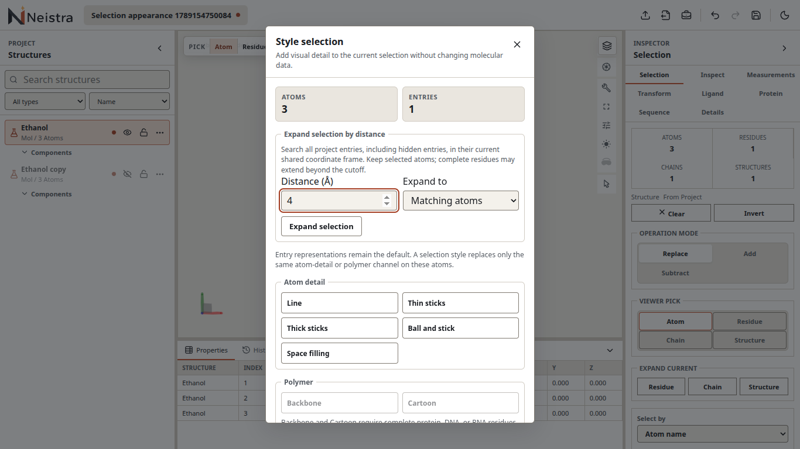
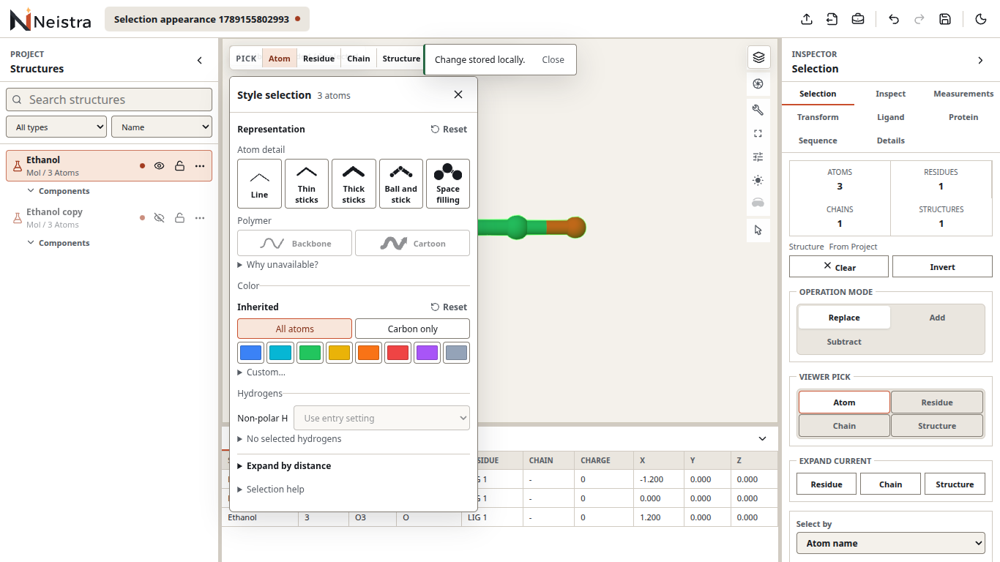

# Selection styling

Select atoms, residues or entries, then activate **Style selection** in the viewer
toolbar. The palette stays open while you pick atoms, change selection in other
panels, or move the camera. Its count always describes the current selection.

- Click a representation illustration to apply it. Atom detail and polymer are
  independent channels. A solid pressed button applies throughout the selection;
  a dashed border and dash mark partial membership. Unavailable polymer styles
  have a **Why unavailable?** disclosure explaining their complete-residue rule.
- Choose **All atoms** or **Carbon only**, then click a color swatch. Mode changes
  alone do not alter atoms. Carbon-only uses the chosen color on selected carbon
  and element colors on other selected atoms; outside atoms are unchanged.
- Open **Custom…** to choose a custom color and press **Apply color**. Mode and
  custom color are remembered while open and reset when you reopen the palette.
- Use the representation or color **Reset** independently. Representation reset
  restores both representation channels to entry defaults. Color reset restores
  the underlying entry theme, including removal of explicit element overrides.
- **Non-polar H** stores Show/Hide/Use entry setting for explicit selected H.
  Selecting heavy atoms does not include attached hydrogens. Master hydrogen,
  entry/component visibility and isolation still apply; help explains these limits.
- Open **Expand by distance** to search all entries, including hidden entries,
  with a positive cutoff (default 4 Å). Choose matching atoms or complete residues.
  The search preserves seeds, assumes a common Cartesian frame, and can be cancelled.

Representation, color and hydrogen edits use the existing undo/redo history.
While an action is pending, its target remains the selection captured at activation.
You may change the selection, but further palette mutations wait until it finishes.
Errors for an older target are labeled **Previous selection**. Empty selection
keeps the palette open with its actions disabled.

Close with the close button, toolbar toggle, or Escape while focus is inside the
palette. Outside clicks do not close it. Switching projects closes it. Help and
secondary actions use keyboard-operable disclosures. On narrow screens the palette
sits at the bottom and scrolls; the rest of the workspace remains available.

## Visual comparison

These actual 1366×768 browser captures use the same ethanol/hidden-copy fixture.
The original 460×680 dialog hid color controls below its initial scroll position;
the compact 340 px palette exposes representation and color controls immediately.
Scientific rendering, data and control behavior are verified separately from these
screenshots; the expanded instructions are intentionally not always visible.

| v0.6.0 | Compact palette |
| --- | --- |
|  |  |

Additional capture: [Pixel 7, dark](assets/selection-styling/after-mobile-dark.png).

Qualification uses pinned Chromium/SwiftShader and Pixel 7 emulation, light/dark
and actual 100%/200% desktop zoom. It does not establish physical-device or other
browser support. This change adds no migration, persisted setting or public API.
New molecular surfaces remain follow-up #30; no presets or hover previews are added.
